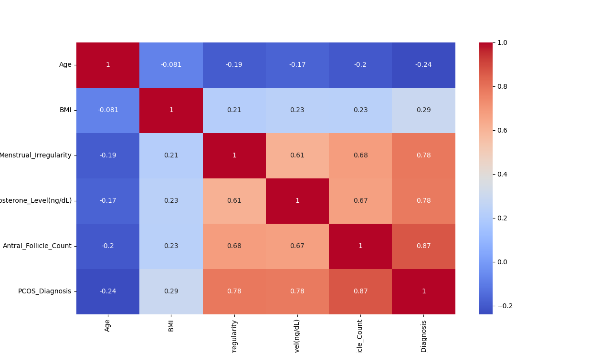

# 🧠 Machine Learning: PCOS Diagnosis Prediction Using Logistic Regression

This project was created for learning purposes related to machine learning.  
The topic was chosen because, as a woman, I am familiar with Polycystic Ovary Syndrome (PCOS), a condition that may affect many individuals.

The goal of this project is to build a machine learning model that predicts whether a person has PCOS using Logistic Regression.

---

## 📂 Dataset
**Source:** Kaggle – Polycystic Ovary Syndrome PCOS 
**Format:** CSV  

🔗 Dataset link: *[Polycystic Ovary Syndrome PCOS](https://www.kaggle.com/datasets/lucass0s0/polycystic-ovary-syndrome-pcos)*

The dataset consists of **3000 rows and 6 columns**:

- `Age`
- `BMI`
- `Menstrual_Irregularity`  
  Converted into a binary variable:
  - `0` = regular (False)
  - `1` = irregular (True)
- `Testosterone_Level (ng/dL)`
- `Antral_Follicle_Count`
- `PCOS_Diagnosis` (Target)  
  Converted into a binary variable:
  - `0` = Non-PCOS (False)
  - `1` = PCOS (True)

No missing values were found after initial inspection.

---

## 🔍 Exploratory Data Analysis (EDA)

EDA was conducted to explore data distribution, identify outliers, and analyze correlations between features and the target variable.

### Distribution Analysis

Histogram plots were used to analyze feature distributions in order to:
- Understand data spread (normal, skewed, or multimodal)
- Determine preprocessing needs such as scaling or transformation

### Feature Distribution Insights

#### 1. Age
- Range approximately 18–44 years
- Relatively uniform distribution
- No abnormal outliers
- Realistic reproductive-age data

**Preprocessing:** StandardScaler

#### 2. BMI
- Near-normal distribution
- Slight right skew
- High values are medically reasonable

**Preprocessing:** StandardScaler

#### 3. Menstrual_Irregularity
- Binary feature

**Preprocessing:** No scaling required

#### 4. Testosterone_Level (ng/dL)
- Right-skewed distribution
- Long tail with high values
- High testosterone is a known PCOS indicator
- Outliers are informative, not noise

**Preprocessing:** StandardScaler

#### 5. Antral Follicle Count (AFC)
- Highly right-skewed
- Majority low values with some very high values (up to ~40)
- High AFC strongly indicates PCOS
- Outliers are medically meaningful

**Preprocessing:** StandardScaler

#### 6. PCOS_Diagnosis (Target)
- Imbalanced distribution:
  - 0 ≈ 80%
  - 1 ≈ 20%

Due to class imbalance, accuracy alone is insufficient.  
Recall and confusion matrix are required for evaluation.

---

## 📌 Outlier Analysis

Boxplots revealed outliers across multiple features.  
However, these outliers are **important medical indicators** rather than noise, therefore no outlier removal was performed.

---

## 🔗 Correlation Analysis

Correlation heatmap results:

| Feature | Correlation |
|------|------------|
| **Antral_Follicle_Count** | **0.87** |
| **Menstrual_Irregularity** | **0.78** |
| **Testosterone_Level** | **0.78** |
| BMI | 0.29 |
| Age | -0.24 |

Strong correlations align with medical literature indicating that hormonal imbalance and ovulatory dysfunction are key indicators of PCOS.

---

## ✂️ 3. Stratified Train-Test Split

A stratified split was applied to preserve the original class distribution of PCOS and Non-PCOS cases.  
This step is crucial due to dataset imbalance to prevent biased evaluation.

---

## ⚙️ 4. Feature Scaling

Numerical features were standardized using **StandardScaler**:
- `fit` applied only on training data
- `transform` applied on both training and testing data

This prevents data leakage and ensures fair feature contribution.

---

## 🤖 5. Logistic Regression Model

Logistic Regression was selected because the target variable is binary.

To address class imbalance:
- `class_weight='balanced'` was applied  
This increases the importance of PCOS cases during training.

---

## 📈 6. Model Evaluation

### Confusion Matrix
[[478 2]
[ 0 120]]

- TN = 478
- FP = 2
- FN = 0
- TP = 120

### Classification Report Highlights
- **Recall (PCOS): 1.00**
- **Precision (PCOS): 0.98**
- **F1-score: 0.99**

The model successfully detected all PCOS cases.  
Despite excellent results, potential overfitting or high dataset informativeness was considered.

---

## 🔁 7. Cross-Validation

To verify model robustness, 5-fold cross-validation was performed using recall as the scoring metric.

Only training data was used.

| Fold | Recall |
|------|--------|
| 1 | 1.00 |
| 2 | 0.9896 |
| 3 | 1.00 |
| 4 | 1.00 |
| 5 | 1.00 |

**Average Recall:** **99.79%**

This confirms strong generalization capability and consistent performance.

---

## 🌐 Deployment

The trained model was deployed using **Streamlit**.

🔗 Live App:  
*[🩺 PCOS Prediction App](https://pcos-app-app-uuyj3qidtew7sowjxx8cz6.streamlit.app)*
